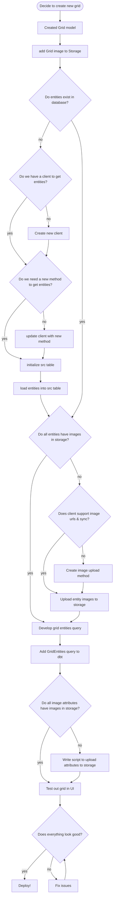

# New Grid Creation Flowchart

```mermaid
flowchart TD
    Start([Decide to create new grid]) --> CreateGridModel[Created Grid model] 
    CreateGridModel --> CreateGridImage[add Grid image to Storage]
    CreateGridImage --> EntitiesCheck{Do entities exist in database?}

    EntitiesCheck -->|no|ClientCheck{Do we have a client to get entities?}
    ClientCheck -->|yes|ClientEntitiesCheck{Do we need a new method to get entities?}
    ClientCheck -->|no|CreateClient[Create new client]
    CreateClient -->ClientEntitiesCheck

    ClientEntitiesCheck -->|yes|CreateSourceSchema[initialize src table]
    ClientEntitiesCheck -->|no|CreateClientMethod[update client with new method]
    CreateClientMethod --> CreateSourceSchema
    CreateSourceSchema --> LoadEntitiesIntoSource[load entities into src table]

    LoadEntitiesIntoSource --> EntityImageCheck

    EntitiesCheck -->|yes|EntityImageCheck{Do all entities have images in storage?}

    EntityImageCheck -->|no|ClientEntityImageSupport{Does client support image urls & sync?}
    EntityImageCheck -->|yes|GridEntitiesQuery[Develop grid entities query]
    ClientEntityImageSupport --> |yes|SyncImages[Upload entity images to storage]
    ClientEntityImageSupport --> |no|CreateImageUploadMethod[Create image upload method]
    CreateImageUploadMethod --> SyncImages
    SyncImages --> GridEntitiesQuery

    GridEntitiesQuery -->GridEntitiesDbt[Add GridEntities query to dbt]

    GridEntitiesDbt -->AttributesImageCheck{Do all image attributes have images in storage?}

    AttributesImageCheck -->|yes|TestGrid[Test out grid in UI]
    AttributesImageCheck -->|no|AttributesScript[Write script to upload attributes to storage]
    AttributesScript --> TestGrid

    TestGrid -->TestPass{Does everything look good?}

    TestPass -->|yes|Deploy[Deploy!]
    TestPass -->|no|FixIssues[Fix issues]
    FixIssues -->TestPass
```
